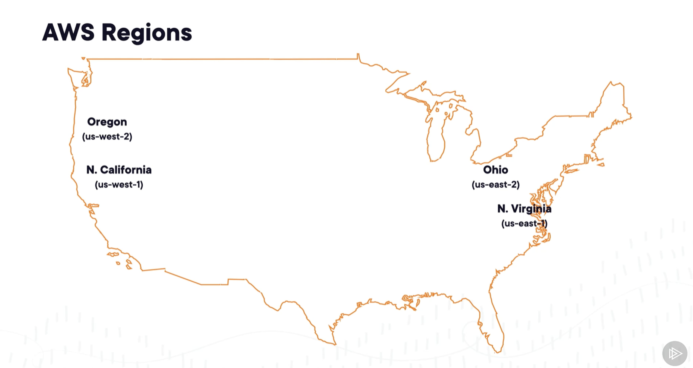
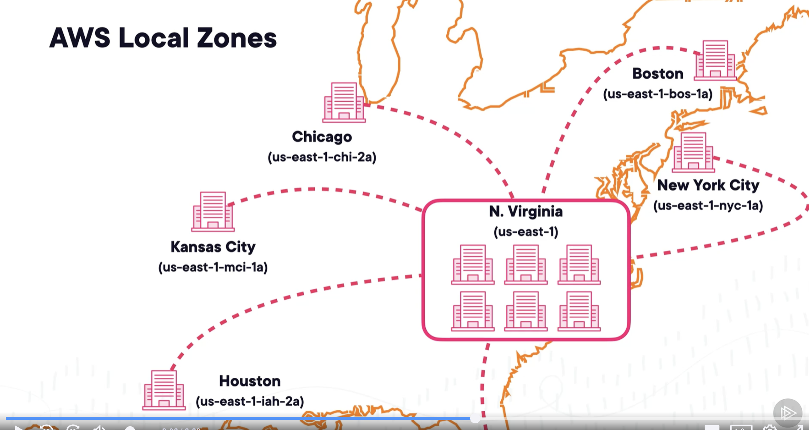

# AWS Global Infrastructure

## Cloud Computing Basics

* def: vast network of globally distributed servers that work together to store and deliver data, run applications, and provide services across the internet

### 3 Issues that Cloud Computing Addresses
* scalability: increase computing resources according to demand immediately
* performance: reduce latency
* fault tolerance: avoid outages

### Further Benefits of the Cloud
* cost efficiency
    * large providers like AWS drive down costs due to economies of scale
    * only pay for the resources you use
    * enables smaller teams (or even single developer) to create globally distributed services and apps because you don't need as many people to maintain the entire infrastructure

## AWS Business Applications
* Backup data
* Implement Internet of Things device management, monitoring
* Takeover traditional IT management
* Machine learning and AI: pre-built models, train and develop new models
* quantum computing algorithm testing
* game development
* augmented and virtual reality

## AWS Regions
* AWS has data centers in multiple regions around the world e.g us-east-1
* each region has 3+ availability zones
    * each zone has 1+ discrete data centers with redundant power, networking, and connectivity within the AWS region
        * ensure fault tolerance
    * example availability zone: us-east-1a

* local zones: clusters of availability zones close geographically
    * attached to an AWS region (e.g us-east-1 below)
    * have limited capabilities
    * help adhere to data residency restrictions by storing and processing data within specific geographical regions
    * ensure that a closer data center can service a user for lower latency

* edge locations: cache objects in content delivery network and provide shortcuts to AWS network
    * mostly hosted by telecom companies partnering with AWS

## Provisioning resources
* in aws accounts, resources in different AWS region are separate from each other

