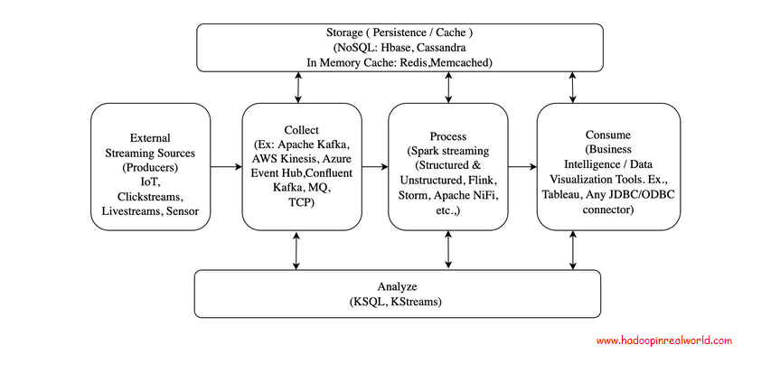

# Big Data

## Basic Architecture

### Enternal Sources/Producers
* gather data and generate events e.g IoT devices, ATMs, UIs [^1]

### Collect
* streaming platforms ingest data from producers
* Options include
    * [Kafka](Kafka/README.md): platform for real-time events
    * Message Queues (MQ): primarily JMS queues; a listener would connect to MQ to pull messages
    * Amazon Kinesis: AWS event streaming service, similar to Kafka
    * Azure Event Hub: Microsoft's streaming platform and event ingestion service 

### Process

### Storage
* can either persist or cache

#### Persistance
* permanent store of data
* typically for maintaining event history, audits, historical analysis, logging, debugging
* Options
    * NoSQL database: DynamoDB (AWS), CosmosDB (Azure), Cassandra

#### Cache
* temporary storage to enable fast lookups
* can also help reduce load on the database, especially for reads
* Options
    * Memcached
    * Redis

### Analyze

### Consume

## Stream vs Message Processing

### Message Processing
* receiving and processing messages from a message queue or a pub/sub system [^2]
* usually use when integrating different systems or components
* a way to decouple different systems, so that they can work together without being too dependent on each other
* e.g RabbitMQ, 

### Stream Processing
* continuously processing and analyzing data in real-time as it flows through a system
* can apply complex operations on multiple input streams,records, or messages
* e.g [Kafka](Kafka/README.md)

#### Why Streaming
* when you need to analyze data as soon as it comes in
    * e.g faults in mission critical systems where any downtime is disruptive

[^1]: https://www.bigdatainrealworld.com/building-big-data-streaming-pipelines-architecture-concepts-and-tool-choices/

[^2]: https://www.bigdatainrealworld.com/stream-processing-vs-message-processing-whats-the-difference/