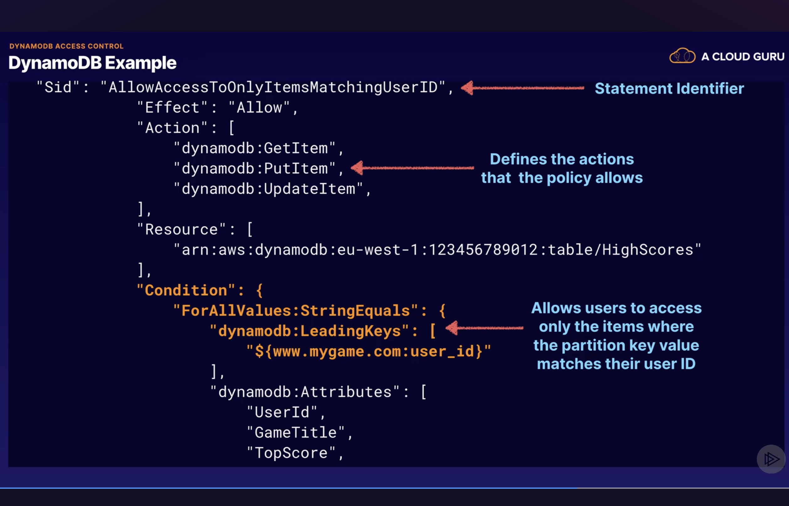

# DynamoDB

### What is it?
* nosql database

### Features
* low-latency: consistent, single-digit millisecond latency at scale
* fully managed
    * support key-value data models
    * supported document formats JSON, HTML, XML
* serverless
* can configure to autoscale
* ssd storage
* resilient: spread across 3 geographically distinct data centers
* consistency models
    * default: **eventually consistent** reads (across all copies, usually achieved within 1 second)
    * best option for read consistency: **strongly consistent** reads (always reflects all successful writes; all writes reflected across all 3 locations at once)
* ACID transactions

### ACID transactions: Atomic, Consistent, Isolated, Durable
* read or write multiple items across multiple tables as an all or nothing operation
    * e.g for credit card transactions that means that when you make a purchase, the withdrawal from your account and deposit into vendor's are both done

## How DynamoDB works
* primary key: used to store and retrieve data
    * Two types: partition and composite key (partition key + sort key)
* partition key: based on unique attribute
    * used as input to hash function that maps partition key to the physical location, the partition, where the data is stored 
* composite key: partition key combined with sort key such that the combination is unique
    * items are sorted by the sort key

## Access Control
* via IAM

Use conditions to control which specific items that people have access to in table:

## Attributes

### Time-to-live (TTL)
* defines expiration date for item, when item will be marked for deletion within 24 hours

## Query
* results of queries are sorted by sort key
* by default, queries are eventually consistent

### Local Secondary Indexes
* allows fast queries based on specific attribute values
* fast because you only search the columns included in the index, rather than the entire database
* made up of the same partition key as the table, but different sort key 
* must be added when creating the table and can't be modified after

### Global Secondary Indexes
* different partition key and different sort key
* can be created whenever

### Parameters
* **ProjectionExpression**: only return specific attributes you want, rather than all of them
* **ScanIndexForward**: return results in ascending order when true, descending if false

## Scans
* dumps entire table and filters out values to give desired result
* process data sequentially, return 1 MB increments before moving on to retrieve the next one
* scans one partition at a time

### Compared to Queries
* less efficient, especially for larger tables
* scan operation on large table can actually take up provisioned thoroughput in one operation
* typically recommended to avoid scan, in favor of queries

### Improving performance
* parallel scans: logically dividing table into segments then scan the segments in parallel
    * avoid if database is already very busy or has heavy read/write activity
* isolate scan operations to specific table and isolate scans from mission critical traffic
* set smaller page size to return less items per operation
    * avoid throttling the table

## Provisioning

### Provisioned Capacity
* use when 
    * read and write capacity requirements can be forecasted
    * traffic is constant or gradually increases
    * otherwise, use on-demand capacity (pay-per-use model)

### Provisioned Thoroughput
* Write Capacity Units (CU): 1 * 1KB per second
* Strongly Consistent Reads CU: 1 * 4KB per second
* Eventually Consistent Reads CU: 2 * 4KB per second

Caculate how much CUs you need:
1. Calculate how many CUs you need for each read or write, rounding up to the nearest whole number
1. Multiply the number by the number of operations you need per second
1. For eventually consistent reads, divide by two

Example: Your table needs to read 80 items per second, and they must be strongly consistent reads. Each item is about 3 KB.
1.  $\lceil 3KB/4KB \rceil$ = 1 CU
1. 1 CU * 80 = 80 CUs
1. For eventually consistent reads, we'd need 80 CU / 2 = 40 CUs

### ProvisionThroughputExceededException
* Cause: request rate is too high for read/write capacity provisioned to DynamoDB table
* How to address:
    * use AWS SDK: will automatically retry requests until successful
    * exponential backoff: if not using AWS SDK
        * basic idea: wait X times longer before each new retry

## Dynamodb Accelerator (DAX)
* in-memory cache for DynamoDB, that's fully managed

### Why use
* great for read-heavy workloads, especially if huge surges are expected
    * 10x read performance improvement
    * e.g black friday sales for retail websites

### Why not use
* if app needs strongly consistent reads: only does eventually consistent reads
* if app has write intensive loads: no benefit to using DAX
* if app doesn't do many reads: no benefit
* if app doesn't need microsecond response times: no benefit 

### How it works
* write-through caching service: data written to cache and backend store at same time
* if item is in cache (cache hit), return result from cache
* if item not in cache (cache miss), gets item from DynamoDB, write it to cache and return result 

## DynamoDB Streams
* time ordered sequence of item level modifications e.g insert, update, delete
* stored as logs for 24 hrs, encrypted at rest

### Why Use
* as event source for lambda
* audit or archive transactions
* replicate data to multiple dynamodb table

### How to Use
* access via dedicated endpoint
