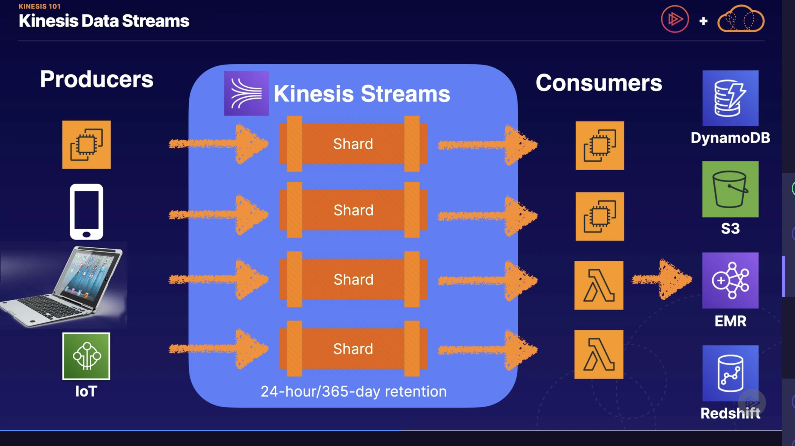
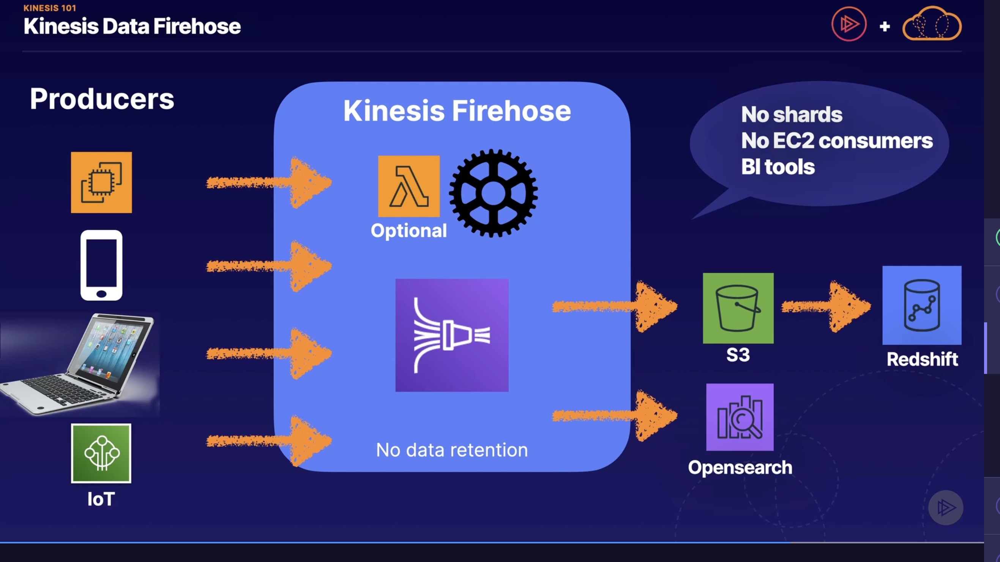
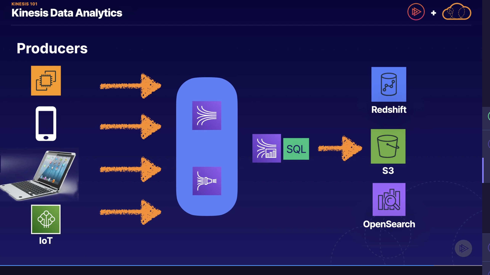

# Kinesis
* set of services to collect, process, or analyze streaming data in real time
* **streaming data**: data generated continously by thousands of data sources that typically send data records simultaneously and in small batches (kilobytes)
    * e.g financial transactions, stock prices, game data, social media feeds, IoT sensors

#### Kinesis Services
* Kinesis Streams
* Kinesis Data Firehose
* Kinesis Data Analytics

## Kinesis Data Streams
* each stream is composed of **shards**
    * a shard is a sequence of one or more data records and provides a fixed unit of capacity
    * each shard provides 5 reads/second (default), with max rate 2 MB/second
    * each shard provides 1000 writes/second (default), max rate 1 MB/second
    * data capacity of stream is determined by number of shards
        * you can increase capacity on stream by increasing the shards
* each record in stream has unique id, and order of records is maintained

## Kinesis Video Stream
* securely stream video from connected devices to AWS
* used for analytics, machine learning

## Kinesis Data Firehose
* capture, transform, and load data into data stores
* no shards, and no data retention

### Firehose Architecture: Stream from producer to data store

* a lambda triggered by firehose can process the data in real-time

## Kinesis Data Analytics
* analyze, query, and transform streamed data in real time using standard SQL
* store results in AWS data store

## Kinesis Client Library (KCL)

### What it does
* ensure there's a record processor for every shard
* manages number of record processors relative to the number of shards and consumers
    * automatically detects when you reshard (increase number of shards)
* if you have 2/+ consumers, it'll load balance and split the number of record processors on each consumer

### Best Practices
* should ensure number of consumer instances doesn't exceed number of shards (except for failover or standby purposes)
    * one worker can process multiple shards
* use CPU utilization to drive the number of consumer instances you have
    * use auto scaling group and base scaling decisions on CPU load on consumers

### Architecture

* Kinesis data analytics performs SQL queries on data stream within kinesis, before the data gets sent to data stores