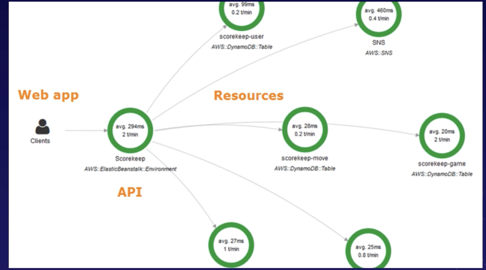
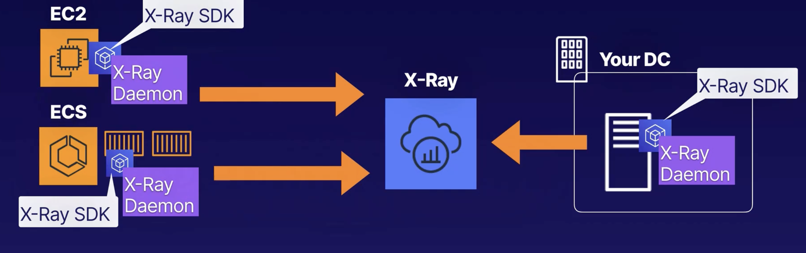

# X-Ray

### Functions
* visualizes application's underlying components
* X-Ray automatically captures metadata for API calls to AWS services using AWS SDK

### Purpose
* help analyze and debug distributed applications

### X Ray Service Map
* end-to-end view of requests as they travel through app
* shows
    * latency
    * http status codes
    * error messages

## Setup X-Ray
1. Install X-ray daemon on 
    * EC2 instance
    * on-premise server
    * ec2 within elastic beanstalk
    *  docker container within ECS cluster
1. Use X-ray SDK to configure application

### X-Ray SDK
* gets info from request and response headers, application code, and AWS resource metadata
* sends all this info to X-Ray daemon 
* can record additional info with annotations
    * key-value pairs indexed by X-ray so you can later use filter expressions to find traces with them

### X-Ray Daemon
* buffers segments of sent info in a queue
* uploads them to X ray in batches

