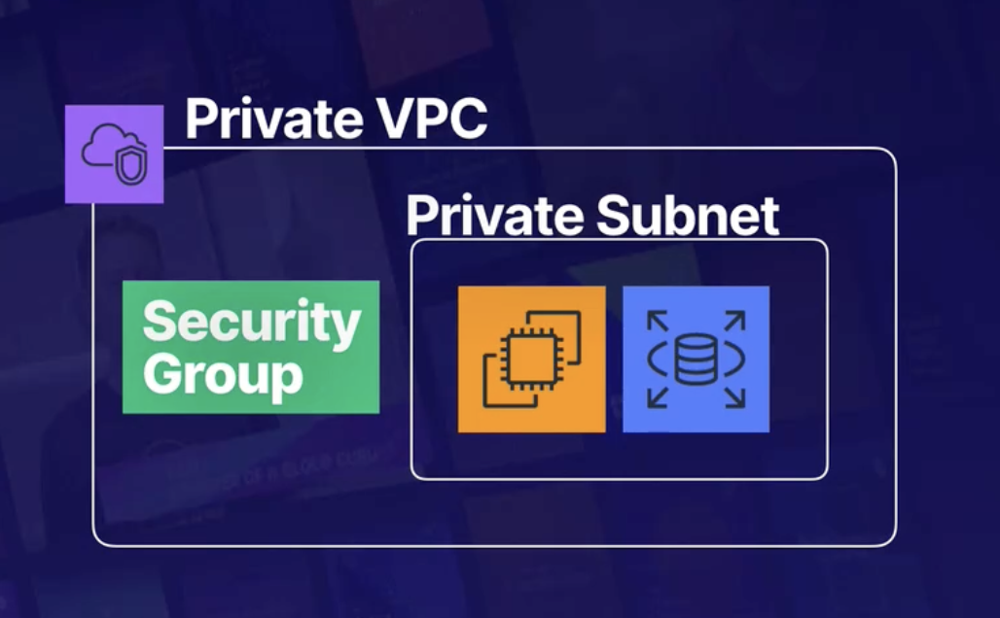

# Lambda

## Properties
* Stateless: can't permanently store data in the function itself
    * to persist data, you need lambda to save to a data store e.g s3 bucket, dynamodb table, EFS
* ephemeral: only runs for a short time; shouldn't be used for apps expected to run longer than 15 minutes

### Versioning
* `$LATEST`: latest version of code uploaded to lambda
* can create aliases for specific versions
* example arn: arn:aws:lambda:us-west-2:<account-id>:function:mylambda:**alias_name**

## Cost (pay by use)
* Requests: $0.20 per 1M requests each month
* Duration: charged in 1 millisecond increments based on memory allocated to lambda function
* price per GB second 
    * if you have a function that uses M GB of memory and runs for T milliseconds, you pay $Price * M * T$

## Triggers
* Event driven Architecture: lambda functions can be automatically triggered by events in S3 or DynamoDB (e.g adding or changing a record in a table)
    * can be triggered by many [other services too](https://aws.amazon.com/blogs/architecture/understanding-the-different-ways-to-invoke-lambda-functions/)
* Triggered by user requests: use API gateway to configure an http endpoint to trigger function with HTTP request

## Limits
* Concurrent Execution limit: limit number of concurrent executions across all functions in a given region per account
    * Default: 1000 per region
    * Error in logs: `TooManyRequestsException`
    * HTTP Status Code: 429
    * Error Message: "Request thoroughput limit exceeded"
    * Common Signs Limit is exceeded:
        * having many lambda functions running in same region and you suddenly see new invocation requests being rejected
    * Solutions:
        * make request to AWS Support Center to increase limit
        * Configure *reserved concurrency*: guarantees set number of executions will always be available for critical functions

## Data Storage Patterns

### /tmp
* temporary storage provided in lambda's execution environment
* by default, 512 MB available; can configure for up to 10 GB
* data isn't persistant, only available for the lifetime of the execution environment
* use as temporary storage for data that will be fetched again within an execution

### Lambda layers
* best practice for adding libraries and SDKs for lambdas to use
    * much better performance for deployments than including libraries and SDKs in the ZIP deployment package
* a layer can be referenced by multiple functions

### S3
* persistent object storage and retrieval only
* NOT a file system
* can't open and write data to objects in S3
* to write data to s3, you need to upload a new object

### EFS (Elastic File System)
* shared file system
* data is persistent and can be dynamically updated
* lambda must be in same VPC as EFS in order to use it

| Storage option | use case | size limit | dynamic updates | shared |
|----------------|----------|------------|-----------------|--------|
| /tmp (in lambda)| temporary data | 512 MB - 10 GB | dynamic read/write | within execution environment |
| lambda layer | libraries and SDKs | 50 MB zipped; 250 MB unzipped | updates requires new layer | shared across execution environments |
| S3 | persistent static data | none | store and retrieval existing objects only; must upload new object to update | shared across execution environments |
| EFS | persistent data | none | dynamic read/write | shared across execution environments, within VPC |

## Environment Variables 
### Why use?
*  change function behavior without changing code, or redeploying

### Properties
* locked when new version of function is published

## Configurable Parameters

### Concurrency
* Reserved concurrency: ensures critical function can always run by restricting other concurrent requests
* Provisioned concurrency: lets function scale consistently without fluctuations in latency

### Memory and CPU capacity
* memory: 128 MB to 10240 MB
* adding memory also adds CPU capacity
* adding memory improves performance if function is either memory or CPU bound
* adding memory can reduce duration that function runs for

## Lambda Lifecycle

### Execution Environment Setup

| Stage | Description |
|-------|-------------|
| Download Code to Execution Environment| After 1st time invoking function, lambda creates execution environment |
| Configure | Memory, runtime, environment variables, etc. |
| Initialization | run function static initialization code; import libraries and dependencies; this step has noticable latency |
| Execute Function | |

#### To Optimize Static Initialization
* Optimize 3 factors:
    * amount of code in initialization phase
    * function package size: imported libraries, dependencies, and lambda layers
        * avoid importing entire SDKs if possible
    * performance of libraries and other services that need connections setup e.g to S3 or DynamoDB

### Invocations

|POV | Synchronous | Asynchronous |
|------|-------------|--------------|
| lambda triggered by service | waits for response, then returns response | will not return response, no acknowledgement that invocation is successfully processed |
| service that triggered lambda | receives response that informs whether lambda completed successfully or not | not notified whether lambda completed successfully or not |
| Example | API Gateway invokes lambda, then returns response to caller | S3 invoke lambda when object is created |

### Handling Errors with Asynchronous Invocation

#### Lambda Retires
* default: 2 retries if function returns error
    * errors include timing out, or code errors
    * lambda waits 1 minute before 1st retry, then 2 minutes on 2nd retry

#### Dead-letter queues
* save failed invocations for further processing, handles failures only
* associated with particular version of a function
* can be an event source for a function, to reprocess events
* Implement with SQS or SNS
    * SQS: holds failed events in queue until they are retrieved
    * SNS: sends notifications about failed events to 1 or more destinations (e.g lambda, emails, http endpoint)

#### Lambda destinations: configure lambda to send invocation records to another services
* send invocation records to one destinations if invocation was successful, but a different one if failed
* Example destinations:
    * SQS: dead-letter queue for devs to review
    * SNS: dead-letter queue to email or SMS the support team 
    * lambda: trigger another function to handle error automatically
    * eventbridge: for successful responses to track successful invocations

## Lambda Deployment Packaging

### Options
* Using the AWS console to create lambda, it automatically creates a zip file for the deployment packaging
* Uploading a zip file to Lambda as your deployment package
    * contains app code and optionally dependencies
* Upload .zip file to S3, if deployment package  > 50 MB
    * need to specify S3 object 

### Lambda Layers
* zip file containing function dependencies e.g libraries, custom runtimes, etc.
* can be shared by multiple functions
* best practice for including dependencies in lambda
    * reduce deployment package size, enabling function to start up faster

## Design Patterns

### Lambda Connected To VPC
* allow lambda to have securely have access to all resources within VPC
* config info labda needs: private subnet ID, security group ID

