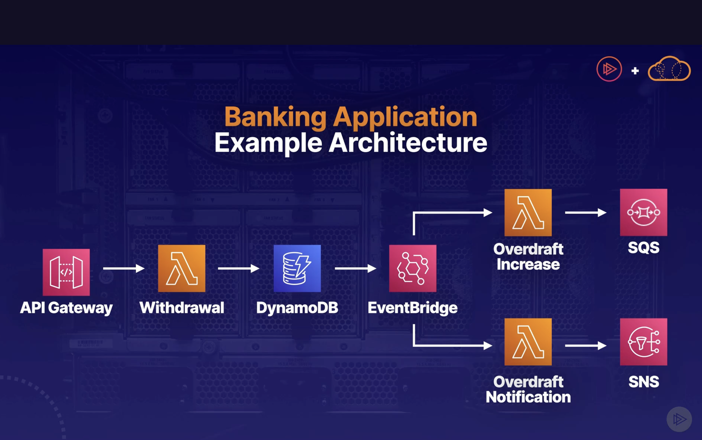

# Serverless

## Event-driven architecture
* asynchronous: an event or message might trigger an action, but no response is expected or needed. So the program can continue processing without waiting for response
* loosely coupled: services and components operate and scale independently of each other
* single-purpose function: stateless functions performing short-lived task

### Typical Setup
* EventSource: some event originating in a particular service, that triggers other services to run
    * e.g update in S3, DynamoDB

* EventRouter: monitors EventSource, and delivers event to EventDestination
    * typically EventBridge
* EventDestination: runs in response to event from EventSource
    * often SNS, Lambda

    
### How to implement with AWS

