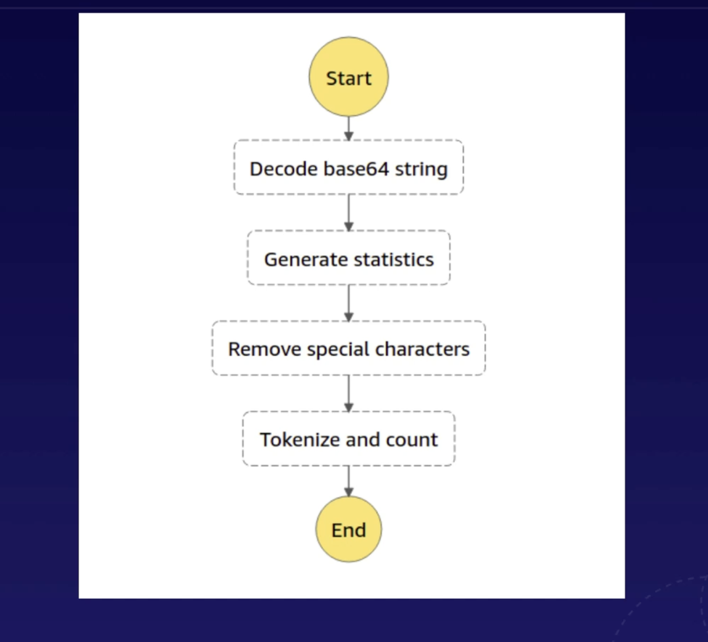
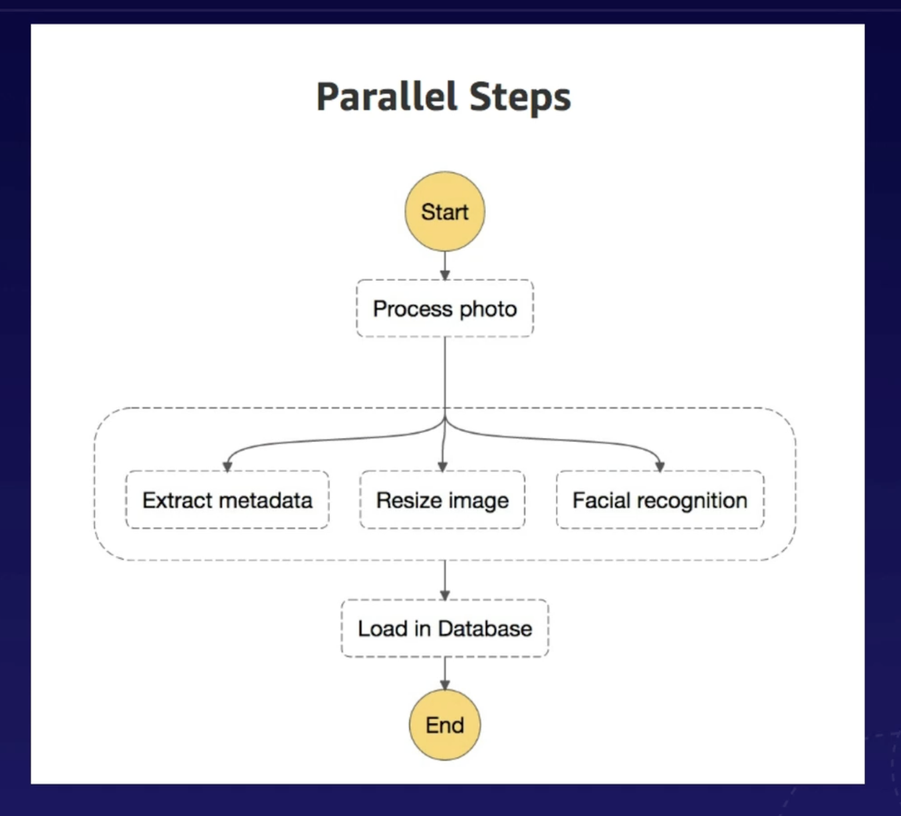
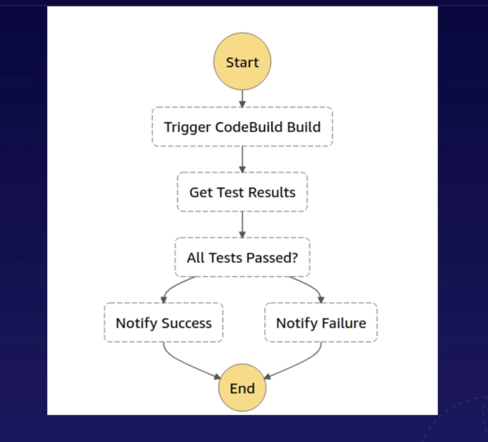

# Step Functions

### What
* visual interface to build and run serverless apps as a series of steps

### How They Work
* automatically trigger and track each step
* output of one step is input for the next step 
* log state of each step to help with debugging

## Terms
* Task: single step, single unit of work
* State Machine: the entire workflow of tasks
    * defined using Amazon State Language
    * implemented as a Cloudformation stack

## Workflow Types

### Standard Workflow
* long-running: run up to a year
* auditable: full execution history available for up to 90 days after completion
* at-most-once model: tasks never executed more than once, unless you explicitly specify retry actions
* non-idempotent actions: actions always causes a change in state
    * e.g sending the same email multiple times causes change in state (multiple copies appear in your outbox)
    * e.g when processing payments, you only want each payment processed once rather than multiple times

### Express Workflows
* short-lived: run up to 5 minutes
* great for high-volume event processing workloads
* at-least-once model: can run more than once
    * can also run multiple concurrently
* idempotent action: identical actions can be made serveral times in a row with no additional side effects
    * e.g reading data from Dynamodb table or S3 bucket
    * e.g putting data into Dynamodb table

#### Synchronous Express Workflow
* waits for workflow to complete before returning result and moving on to next task
* good for operations to perform one at a time

#### Asynchronous Express Workflow
* result of workflow can be found in Cloudwatch logs
* doesn't wait for workflow to complete
* good for services and operations that don't depend on completion and result of your workflow

### Sequential Workflow

* steps happen one after the other
* output of one step is input for the next step 
* each step is fulfilled by separate lambda functions
* "Decode base64 string" is a *task*
* Everything between Start and End is a *state machine*

### Parallel Workflow

* These steps are running in parallel in separate lambda functions
    * "Extract metadata"
    * "Resize image"
    * "Facial Recognition"

### Branching Workflow

* branches at "All Tests Passed?" task, which determines which lambda function to run
    * yes: run "Notify Success"
    * no: run "Notify Failure"

